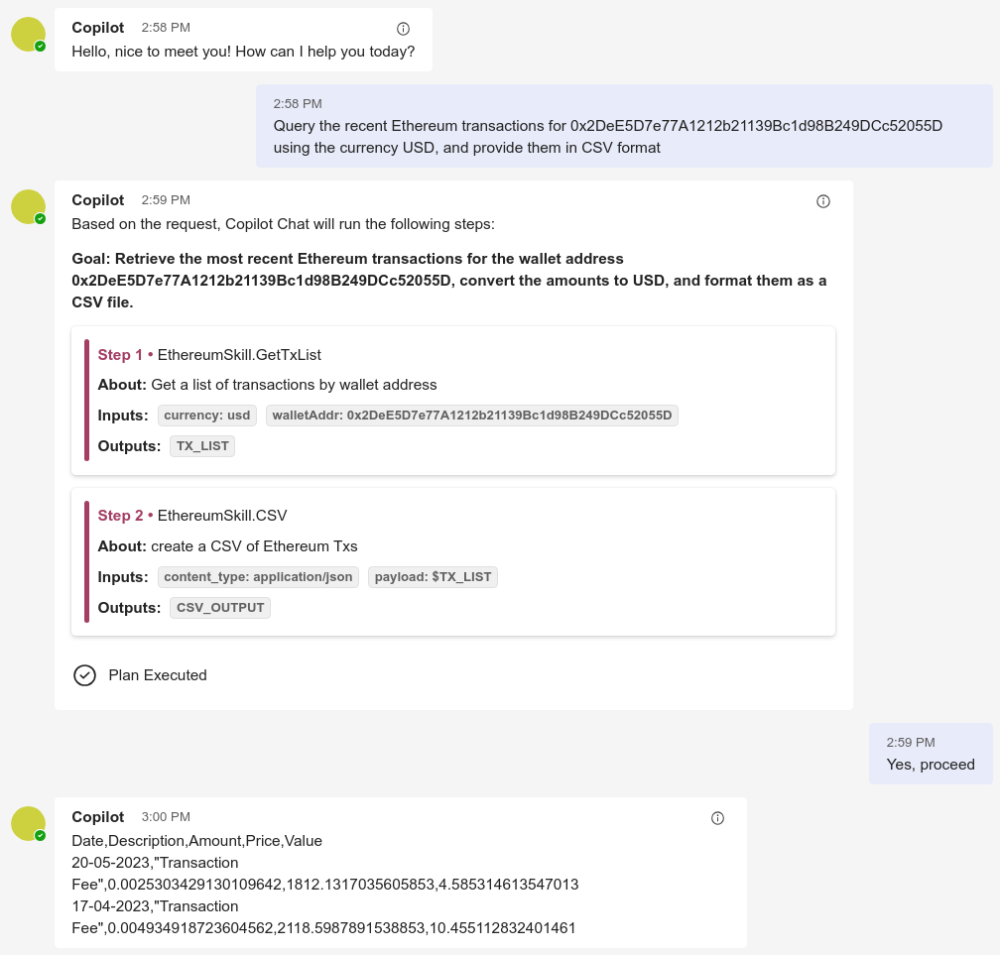

# Semantic Kernel ChatGPT plugin for Ethereum Txs

This project implements a ChatGPT plugin for Ethereum. It includes the following components:
- An endpoint that serves up an ai-plugin.json file for ChatGPT to discover the plugin
- A generator that automatically converts prompts into semantic function endpoints
- One native function that calls the Etherscan API endpoint for transaction information, and a CoinGecko API endpoint to get the historical price of Ethereum
- Two semantic functions that format the JSON response into CSV or OFX for import into accounting software


## Example Output



## Prerequisites

- Install `Docker` and VS Code `Dev Containers` extension.
- Clone project and run `Dev-Containers: Reopen in Container` command
  - The dev container will download and install the .NET 6 image and install the `C#`, `Semantic Kernel Tools`, and `GitHub Copilot` extensions.
- [Create a free Etherscan Account](https://docs.etherscan.io/getting-started/creating-an-account) and [get an API key](https://docs.etherscan.io/getting-started/viewing-api-usage-statistics)

### Using appsettings.json

Configure an OpenAI endpoint

1. Copy [settings.json.openai-example](./config/appsettings.json.openai-example) to `./appsettings.json`
1. Edit the `kernel` object to add your OpenAI endpoint configuration
1. Edit the `aiPlugin` object to define the properties that get exposed in the ai-plugin.json file

Configure an Azure OpenAI endpoint

1. Copy [settings.json.azure-example](./config/appsettings.json.azure-example) to `./appsettings.json`
1. Edit the `kernel` object to add your Azure OpenAI endpoint configuration
1. Edit the `aiPlugin` object to define the properties that get exposed in the ai-plugin.json file

### Using local.settings.json

1. Copy [local.settings.json.example](./azure-function/local.settings.json.example) to `./azure-function/local.settings.json`
1. Edit the `Values` object to add your OpenAI endpoint configuration in the `apiKey` property
1. Edit the `Values` object to add your Etherscan API endpoint configuration in the `etherscanApiKey` property

## Running the endpoint

To run the Azure Functions application just hit `F5`.

To build and run the Azure Functions application from a terminal use the following commands:

```powershell
cd azure-function
dotnet build
func start --csharp
```

Test the endpoint with the [Swagger UI](http://localhost:7071/swagger/ui)

## Learn More

To learn more, see the Semantic Kernel documentation that describes how to [create a ChatGPT plugin](https://learn.microsoft.com/en-us/semantic-kernel/ai-orchestration/chatgpt-plugins).

